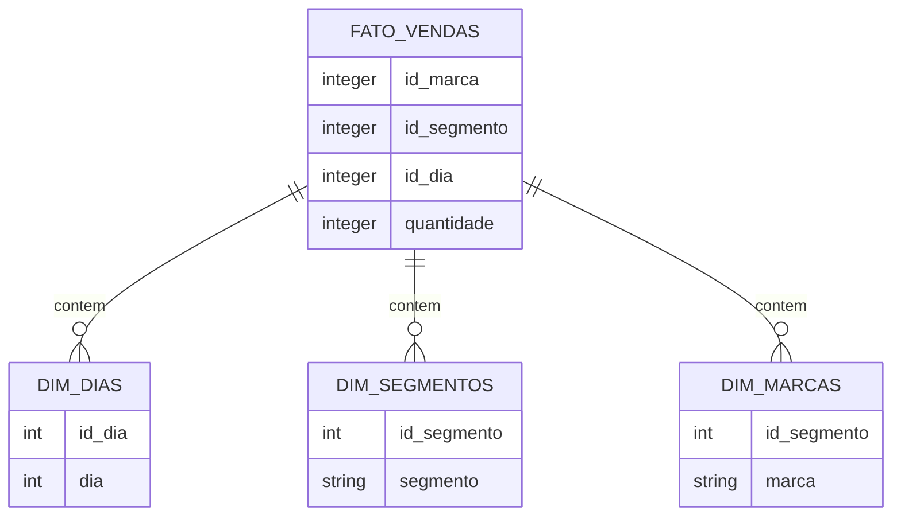

Criando uma tabela no Schema Estrela com formato:



Dados:

```sql
-- =========================
-- DROP TABLE IF EXISTS
-- (ordem correta por FK)
-- =========================

DROP TABLE IF EXISTS fato_vendas CASCADE;
DROP TABLE IF EXISTS dim_dias CASCADE;
DROP TABLE IF EXISTS dim_segmentos CASCADE;
DROP TABLE IF EXISTS dim_marcas CASCADE;

-- =========================
-- 1) CRIAÇÃO DAS TABELAS
-- =========================

CREATE TABLE dim_marcas (
    id_marca INT PRIMARY KEY,
    marca VARCHAR NOT NULL
);

CREATE TABLE dim_segmentos (
    id_segmento INT PRIMARY KEY,
    segmento VARCHAR NOT NULL
);

CREATE TABLE dim_dias (
    id_dia INT PRIMARY KEY,
    dia INT NOT NULL
);

CREATE TABLE fato_vendas (
    id_marca INT NOT NULL,
    id_segmento INT NOT NULL,
    id_dia INT NOT NULL,
    quantidade INT NOT NULL,

    FOREIGN KEY (id_marca) REFERENCES dim_marcas(id_marca),
    FOREIGN KEY (id_segmento) REFERENCES dim_segmentos(id_segmento),
    FOREIGN KEY (id_dia) REFERENCES dim_dias(id_dia)
);
```

Preenchimento dos dados:

```sql
-- =========================
-- 2) PREENCHIMENTO DOS DADOS
-- =========================

INSERT INTO dim_marcas (id_marca, marca)
VALUES
    (1, 'Naique'),
    (2, 'Ardida'),
    (3, 'Pumita'),
    (4, 'Reeboca');

INSERT INTO dim_segmentos (id_segmento, segmento)
VALUES
    (1, 'Premium'),
    (2, 'Corrida'),
    (3, 'Futebol'),
    (4, 'Casual'),
    (5, 'Treino');

INSERT INTO dim_dias (id_dia, dia)
VALUES
    (1, 1),
    (2, 2),
    (3, 3),
    (4, 4),
    (5, 5),
    (6, 6),
    (7, 7),
    (8, 8),
    (9, 9),
    (10, 10);

INSERT INTO fato_vendas (id_marca, id_segmento, id_dia, quantidade)
VALUES
-- Naique (1)
(1, 1, 1, 100),(1, 1, 2, 110),(1, 1, 3, 120),(1, 1, 4, 115),
(1, 2, 1, 200),(1, 2, 2, 190),(1, 2, 3, 210),(1, 2, 4, 205),
(1, 3, 1, 150),(1, 3, 2, 160),(1, 3, 3, 140),(1, 3, 4, 170),
(1, 4, 1, 90 ),(1, 4, 2, 95 ),(1, 4, 3, 105),(1, 4, 4, 100),
(1, 5, 1, 130),(1, 5, 2, 125),(1, 5, 3, 135),(1, 5, 4, 140),

-- Ardida (2)
(2, 1, 1, 80 ),(2, 1, 2, 88 ),(2, 1, 3, 92 ),(2, 1, 4, 90 ),
(2, 2, 1, 300),(2, 2, 2, 400),(2, 2, 3, 320),(2, 2, 4, 380),
(2, 3, 1, 310),(2, 3, 2, 279),(2, 3, 3, 295),(2, 3, 4, 305),
(2, 4, 1, 150),(2, 4, 2, 155),(2, 4, 3, 160),(2, 4, 4, 165),
(2, 5, 1, 210),(2, 5, 2, 205),(2, 5, 3, 215),(2, 5, 4, 220),

-- Pumita (3)
(3, 1, 1, 120),(3, 1, 2, 125),(3, 1, 3, 130),(3, 1, 4, 128),
(3, 2, 1, 180),(3, 2, 2, 175),(3, 2, 3, 190),(3, 2, 4, 185),
(3, 3, 1, 250),(3, 3, 2, 240),(3, 3, 3, 260),(3, 3, 4, 255),
(3, 4, 1, 95 ),(3, 4, 2, 100),(3, 4, 3, 98 ),(3, 4, 4, 105),
(3, 5, 1, 160),(3, 5, 2, 165),(3, 5, 3, 170),(3, 5, 4, 175),

-- Reeboca (4)
(4, 1, 1, 140),(4, 1, 2, 145),(4, 1, 3, 150),(4, 1, 4, 155),
(4, 2, 1, 220),(4, 2, 2, 210),(4, 2, 3, 230),(4, 2, 4, 225),
(4, 3, 1, 180),(4, 3, 2, 175),(4, 3, 3, 185),(4, 3, 4, 190),
(4, 4, 1, 110),(4, 4, 2, 115),(4, 4, 3, 120),(4, 4, 4, 118),
(4, 5, 1, 200),(4, 5, 2, 195),(4, 5, 3, 205),(4, 5, 4, 210);
```

Mostrando a tabela toda:

```sql
SELECT
    m.marca,
    s.segmento,
    d.dia,
    f.quantidade
FROM fato_vendas f
JOIN dim_marcas m ON f.id_marca = m.id_marca
JOIN dim_segmentos s ON f.id_segmento = s.id_segmento
JOIN dim_dias d ON f.id_dia = d.id_dia;
```

# Drill-down

## **🎯 Objetivo**

Você é um analista e quer investigar **onde estão as maiores vendas** e como elas se distribuem.

Drill-down em 4 níveis:

1. **Total Geral**

```sql
SELECT 
    SUM(f.quantidade) AS total_geral
FROM fato_vendas f;
```

1. **Total por Marca**

```sql
SELECT
    m.marca,
    SUM(f.quantidade) AS total_marca
FROM fato_vendas f
JOIN dim_marcas m ON f.id_marca = m.id_marca
GROUP BY m.marca
ORDER BY total_marca DESC;
```

1. **Total por Marca + Segmento**

```sql
SELECT
    m.marca,
    s.segmento,
    SUM(f.quantidade) AS total_segmento
FROM fato_vendas f
JOIN dim_marcas m ON f.id_marca = m.id_marca
JOIN dim_segmentos s ON f.id_segmento = s.id_segmento
GROUP BY m.marca, s.segmento
ORDER BY m.marca, total_segmento DESC;
```

1. **Total por Marca + Segmento + Dia**

```sql
SELECT
    m.marca,
    s.segmento,
    d.dia,
    SUM(f.quantidade) AS total_dia
FROM fato_vendas f
JOIN dim_marcas m ON f.id_marca = m.id_marca
JOIN dim_segmentos s ON f.id_segmento = s.id_segmento
JOIN dim_dias d ON f.id_dia = d.id_dia
GROUP BY m.marca, s.segmento, d.dia
ORDER BY m.marca, s.segmento, d.dia;
```

# Roll-up

## **🎯 Cenário**

Você quer analisar vendas (quantidade) com subtotais em níveis hierárquicos:

📌 Hierarquia de análise:

**Marca → Segmento → Dia → Total Geral**

## **✅ Questão 1**

Crie um relatório que traga:

- Total por **Marca + Segmento + Dia**
- Subtotal por **Marca + Segmento**
- Subtotal por **Marca**
- Total geral

```sql
SELECT
    m.marca,
    s.segmento,
    d.dia,
    SUM(f.quantidade) AS total_vendas
FROM fato_vendas f
JOIN dim_marcas m ON f.id_marca = m.id_marca
JOIN dim_segmentos s ON f.id_segmento = s.id_segmento
JOIN dim_dias d ON f.id_dia = d.id_dia
GROUP BY ROLLUP (m.marca, s.segmento, d.dia)
ORDER BY m.marca, s.segmento, d.dia;
```

**✅ Questão 2**

Modifique o relatório para mostrar explicitamente:

- "TOTAL_SEGMENTO" quando for subtotal por marca+segmento
- "TOTAL_MARCA" quando for subtotal por marca
- "TOTAL_GERAL" no total final

```sql
SELECT
    COALESCE(m.marca, 'TOTAL_GERAL') AS marca,
    CASE
        WHEN GROUPING(m.marca) = 1 THEN NULL
        WHEN GROUPING(s.segmento) = 1 THEN 'TOTAL_MARCA'
        ELSE s.segmento
    END AS segmento,
    CASE
        WHEN GROUPING(m.marca) = 1 THEN NULL
        WHEN GROUPING(s.segmento) = 1 THEN NULL
        WHEN GROUPING(d.dia) = 1 THEN 'TOTAL_SEGMENTO'
        ELSE d.dia::TEXT
    END AS dia,
    SUM(f.quantidade) AS total_vendas
FROM fato_vendas f
JOIN dim_marcas m ON f.id_marca = m.id_marca
JOIN dim_segmentos s ON f.id_segmento = s.id_segmento
JOIN dim_dias d ON f.id_dia = d.id_dia
GROUP BY ROLLUP (m.marca, s.segmento, d.dia)
ORDER BY
    GROUPING(m.marca), m.marca,
    GROUPING(s.segmento), s.segmento,
    GROUPING(d.dia), d.dia;
```

## **✅ Questão 3**

Faça um relatório que tenha:

- Total por marca + segmento
- Subtotal por marca
- Total geral

```sql
SELECT
    m.marca,
    s.segmento,
    SUM(f.quantidade) AS total_vendas
FROM fato_vendas f
JOIN dim_marcas m ON f.id_marca = m.id_marca
JOIN dim_segmentos s ON f.id_segmento = s.id_segmento
GROUP BY ROLLUP (m.marca, s.segmento)
ORDER BY m.marca, s.segmento;
```

## **✅ Questão 4**

Retorne somente os **subtotais** e o **total geral** (não mostrar linhas detalhadas por dia).

💡 Dica: você pode filtrar usando GROUPING().

```sql
SELECT
    m.marca,
    s.segmento,
    d.dia,
    SUM(f.quantidade) AS total_vendas
FROM fato_vendas f
JOIN dim_marcas m ON f.id_marca = m.id_marca
JOIN dim_segmentos s ON f.id_segmento = s.id_segmento
JOIN dim_dias d ON f.id_dia = d.id_dia
GROUP BY ROLLUP (m.marca, s.segmento, d.dia)
HAVING GROUPING(d.dia) = 1   -- remove os detalhes por dia
ORDER BY m.marca, s.segmento;
```

https://neon.com/postgresql/postgresql-tutorial/postgresql-coalesce

https://neon.com/postgresql/postgresql-tutorial/postgresql-grouping-sets

# Slice

## **🎯 Cenário**

Você recebeu a tarefa de analisar as vendas, mas o gerente quer olhar apenas:

- **1 marca específica** (ex.: *Ardida*)
- **ou 1 segmento específico** (ex.: *Corrida*)
- **ou 1 dia específico** (ex.: *dia 2*)

A partir daí você deve gerar relatórios agregados.

## **✅ Questão 1**

📌 Faça um **slice** selecionando apenas a marca **Ardida** e traga o total vendido por **segmento**.

```sql
SELECT
    s.segmento,
    SUM(f.quantidade) AS total_vendas
FROM fato_vendas f
JOIN dim_marcas m ON f.id_marca = m.id_marca
JOIN dim_segmentos s ON f.id_segmento = s.id_segmento
WHERE m.marca = 'Ardida'   -- SLICE aqui
GROUP BY s.segmento
ORDER BY total_vendas DESC;
```

## **✅ Questão 2**

📌 Faça um slice do segmento **Corrida** e traga o total vendido por **marca**.

```sql
SELECT
    m.marca,
    SUM(f.quantidade) AS total_vendas
FROM fato_vendas f
JOIN dim_marcas m ON f.id_marca = m.id_marca
JOIN dim_segmentos s ON f.id_segmento = s.id_segmento
WHERE s.segmento = 'Corrida'   -- SLICE aqui
GROUP BY m.marca
ORDER BY total_vendas DESC;
```

## **✅ Questão 3**

📌 Faça um slice do **dia 2**, mostrando o total vendido por **marca e segmento**.

```sql
SELECT
    m.marca,
    s.segmento,
    SUM(f.quantidade) AS total_vendas
FROM fato_vendas f
JOIN dim_marcas m ON f.id_marca = m.id_marca
JOIN dim_segmentos s ON f.id_segmento = s.id_segmento
JOIN dim_dias d ON f.id_dia = d.id_dia
WHERE d.dia = 2   -- SLICE aqui
GROUP BY m.marca, s.segmento
ORDER BY m.marca, total_vendas DESC;
```

## **✅ Questão 4**

📌 Faça um slice da **marca Naique**, e realize **drill-down**:

- Total por segmento
- Dentro do segmento, detalhar por dia

```sql
SELECT
    s.segmento,
    d.dia,
    SUM(f.quantidade) AS total_vendas
FROM fato_vendas f
JOIN dim_marcas m ON f.id_marca = m.id_marca
JOIN dim_segmentos s ON f.id_segmento = s.id_segmento
JOIN dim_dias d ON f.id_dia = d.id_dia
WHERE m.marca = 'Naique'   -- SLICE aqui
GROUP BY s.segmento, d.dia
ORDER BY s.segmento, d.dia;
```

## **✅ Questão 5  (filtro em mais de uma dimensão)**

📌 Faça um slice selecionando:

- marca = *Reeboca*
- segmento = *Treino*

e mostre as vendas por dia.

```sql
SELECT
    d.dia,
    SUM(f.quantidade) AS total_vendas
FROM fato_vendas f
JOIN dim_marcas m ON f.id_marca = m.id_marca
JOIN dim_segmentos s ON f.id_segmento = s.id_segmento
JOIN dim_dias d ON f.id_dia = d.id_dia
WHERE m.marca = 'Reeboca'
  AND s.segmento = 'Treino'
GROUP BY d.dia
ORDER BY d.dia;
```

# Dice

## **✅ Exercício 1 — Dice por conjunto de marcas**

📌 Analise as vendas somente para as marcas **Naique** e **Ardida**, mostrando o total por marca e segmento.

```sql
SELECT
    m.marca,
    s.segmento,
    SUM(f.quantidade) AS total_vendas
FROM fato_vendas f
JOIN dim_marcas m ON f.id_marca = m.id_marca
JOIN dim_segmentos s ON f.id_segmento = s.id_segmento
WHERE m.marca IN ('Naique', 'Ardida')     -- DICE (marcas)
GROUP BY m.marca, s.segmento
ORDER BY m.marca, total_vendas DESC;
```

## **✅ Exercício 2 — Dice por conjunto de segmentos**

📌 Analise apenas os segmentos **Premium** e **Treino**, mostrando total por marca.

```sql
SELECT
    m.marca,
    SUM(f.quantidade) AS total_vendas
FROM fato_vendas f
JOIN dim_marcas m ON f.id_marca = m.id_marca
JOIN dim_segmentos s ON f.id_segmento = s.id_segmento
WHERE s.segmento IN ('Premium', 'Treino')  -- DICE (segmentos)
GROUP BY m.marca
ORDER BY total_vendas DESC;
```

## **✅ Exercício 3 — Dice por intervalo de tempo (dias)**

📌 Analise as vendas apenas nos dias **2 até 4**, mostrando o total por segmento.

```sql
SELECT
    s.segmento,
    SUM(f.quantidade) AS total_vendas
FROM fato_vendas f
JOIN dim_segmentos s ON f.id_segmento = s.id_segmento
JOIN dim_dias d ON f.id_dia = d.id_dia
WHERE d.dia BETWEEN 2 AND 4     -- DICE (intervalo)
GROUP BY s.segmento
ORDER BY total_vendas DESC;
```

## **✅ Exercício 4 — Dice combinando 2 dimensões**

📌 Analise apenas:

- marcas **Pumita e Reeboca**
- segmentos **Futebol e Corrida**

E mostre o total por marca e segmento.

```sql
SELECT
    m.marca,
    s.segmento,
    SUM(f.quantidade) AS total_vendas
FROM fato_vendas f
JOIN dim_marcas m ON f.id_marca = m.id_marca
JOIN dim_segmentos s ON f.id_segmento = s.id_segmento
WHERE m.marca IN ('Pumita', 'Reeboca')  
  AND s.segmento IN ('Futebol', 'Corrida')    -- DICE (2 dimensões)
GROUP BY m.marca, s.segmento
ORDER BY m.marca, s.segmento;
```

## **✅ Exercício 5 — Dice com 3 dimensões (subcubo)**

📌 Selecione um subcubo onde:

- marcas: **Ardida, Naique**
- segmentos: **Corrida, Treino**
- dias: **1 até 3**

E mostre o total por marca, segmento e dia.

```sql
SELECT
    m.marca,
    s.segmento,
    d.dia,
    SUM(f.quantidade) AS total_vendas
FROM fato_vendas f
JOIN dim_marcas m ON f.id_marca = m.id_marca
JOIN dim_segmentos s ON f.id_segmento = s.id_segmento
JOIN dim_dias d ON f.id_dia = d.id_dia
WHERE m.marca IN ('Ardida', 'Naique')
  AND s.segmento IN ('Corrida', 'Treino')
  AND d.dia BETWEEN 1 AND 3      -- DICE (3 dimensões)
GROUP BY m.marca, s.segmento, d.dia
ORDER BY m.marca, s.segmento, d.dia;
```

### **Exercício 6 (Desafio) — Dice + CUBE**

📌 Faça um relatório de análise para o subconjunto:

- marcas: **Naique, Reeboca**
- dias: **1 até 4**

E gere subtotais usando **CUBE** em (marca, segmento, dia).

✅ Isso simula um cubo OLAP real, mas com uma “janela” de dados.

```sql
SELECT
    m.marca,
    s.segmento,
    d.dia,
    SUM(f.quantidade) AS total_vendas
FROM fato_vendas f
JOIN dim_marcas m ON f.id_marca = m.id_marca
JOIN dim_segmentos s ON f.id_segmento = s.id_segmento
JOIN dim_dias d ON f.id_dia = d.id_dia
WHERE m.marca IN ('Naique', 'Reeboca')   -- DICE
  AND d.dia BETWEEN 1 AND 4              -- DICE
GROUP BY CUBE (m.marca, s.segmento, d.dia)
ORDER BY m.marca, s.segmento, d.dia;
```

# Pivot

### **✅ Exercício 1 — Pivot de Segmentos em Colunas (por Marca)**

📌 Objetivo: Mostrar as marcas nas linhas e os segmentos como colunas:

| **marca** | **premium** | **corrida** | **futebol** | **casual** | **treino** |
| --- | --- | --- | --- | --- | --- |

---

## **✅ Opção A: Pivot com FILTER (recomendado)**

```
SELECT
    m.marca,
    SUM(f.quantidade) FILTER (WHERE s.segmento = 'Premium') AS premium,
    SUM(f.quantidade) FILTER (WHERE s.segmento = 'Corrida') AS corrida,
    SUM(f.quantidade) FILTER (WHERE s.segmento = 'Futebol') AS futebol,
    SUM(f.quantidade) FILTER (WHERE s.segmento = 'Casual')  AS casual,
    SUM(f.quantidade) FILTER (WHERE s.segmento = 'Treino')  AS treino
FROM fato_vendas f
JOIN dim_marcas m ON f.id_marca = m.id_marca
JOIN dim_segmentos s ON f.id_segmento = s.id_segmento
GROUP BY m.marca
ORDER BY m.marca;
```

✅ Mais limpo que CASE.

---

## **✅ Opção B: Pivot com CASE WHEN**

```
SELECT
    m.marca,
    SUM(CASE WHEN s.segmento = 'Premium' THEN f.quantidade ELSE 0 END) AS premium,
    SUM(CASE WHEN s.segmento = 'Corrida' THEN f.quantidade ELSE 0 END) AS corrida,
    SUM(CASE WHEN s.segmento = 'Futebol' THEN f.quantidade ELSE 0 END) AS futebol,
    SUM(CASE WHEN s.segmento = 'Casual'  THEN f.quantidade ELSE 0 END) AS casual,
    SUM(CASE WHEN s.segmento = 'Treino'  THEN f.quantidade ELSE 0 END) AS treino
FROM fato_vendas f
JOIN dim_marcas m ON f.id_marca = m.id_marca
JOIN dim_segmentos s ON f.id_segmento = s.id_segmento
GROUP BY m.marca
ORDER BY m.marca;
```

---

### **✅ Exercício 2 — Pivot de Dias em Colunas (por Marca)**

📌 Objetivo: ver o total vendido por marca em cada dia:

| **marca** | **dia_1** | **dia_2** | **dia_3** | **dia_4** |
| --- | --- | --- | --- | --- |

✅ Com FILTER para ficar mais elegante.

```
SELECT
    m.marca,
    SUM(f.quantidade) FILTER (WHERE d.dia = 1) AS dia_1,
    SUM(f.quantidade) FILTER (WHERE d.dia = 2) AS dia_2,
    SUM(f.quantidade) FILTER (WHERE d.dia = 3) AS dia_3,
    SUM(f.quantidade) FILTER (WHERE d.dia = 4) AS dia_4
FROM fato_vendas f
JOIN dim_marcas m ON f.id_marca = m.id_marca
JOIN dim_dias d ON f.id_dia = d.id_dia
GROUP BY m.marca
ORDER BY m.marca;
```

---

### **✅ Exercício 3 — Pivot duplo (Marca x Segmento) em matriz**

📌 Objetivo: construir uma matriz onde:

- LINHA = marca
- COLUNAS = segmentos
- VALOR = total de vendas

✅ Igual exercício 1, mas agora também mostrar o total geral da linha.

```
SELECT
    m.marca,
    SUM(f.quantidade) FILTER (WHERE s.segmento = 'Premium') AS premium,
    SUM(f.quantidade) FILTER (WHERE s.segmento = 'Corrida') AS corrida,
    SUM(f.quantidade) FILTER (WHERE s.segmento = 'Futebol') AS futebol,
    SUM(f.quantidade) FILTER (WHERE s.segmento = 'Casual')  AS casual,
    SUM(f.quantidade) FILTER (WHERE s.segmento = 'Treino')  AS treino,
    SUM(f.quantidade) AS total_marca
FROM fato_vendas f
JOIN dim_marcas m ON f.id_marca = m.id_marca
JOIN dim_segmentos s ON f.id_segmento = s.id_segmento
GROUP BY m.marca
ORDER BY total_marca DESC;
```

---

### **✅ Exercício 4 — Pivot: Segmento nas colunas, mas por Dia**

📌 Objetivo:

Linhas = dia

Colunas = segmentos

Valor = total de vendas

```
SELECT
    d.dia,
    SUM(f.quantidade) FILTER (WHERE s.segmento = 'Premium') AS premium,
    SUM(f.quantidade) FILTER (WHERE s.segmento = 'Corrida') AS corrida,
    SUM(f.quantidade) FILTER (WHERE s.segmento = 'Futebol') AS futebol,
    SUM(f.quantidade) FILTER (WHERE s.segmento = 'Casual')  AS casual,
    SUM(f.quantidade) FILTER (WHERE s.segmento = 'Treino')  AS treino,
    SUM(f.quantidade) AS total_dia
FROM fato_vendas f
JOIN dim_dias d ON f.id_dia = d.id_dia
JOIN dim_segmentos s ON f.id_segmento = s.id_segmento
GROUP BY d.dia
ORDER BY d.dia;
```

---

### **⭐ Exercício 5 (Avançado) — Pivot dinâmico com crosstab()**

Aqui entra o verdadeiro pivot “de BI”.

⚠️ Precisa habilitar a extensão **tablefunc**.

---

## **✅ Passo 1: Habilitar a extensão**

```
CREATE EXTENSION IF NOT EXISTS tablefunc;
```

---

## **✅ Passo 2: Pivot (marca x segmento)**

📌 Resultado será:

| marca | Premium | Corrida | Futebol | Casual | Treino |

```
SELECT *
FROM crosstab(
  $$
    SELECT
      m.marca,
      s.segmento,
      SUM(f.quantidade) AS total
    FROM fato_vendas f
    JOIN dim_marcas m ON f.id_marca = m.id_marca
    JOIN dim_segmentos s ON f.id_segmento = s.id_segmento
    GROUP BY m.marca, s.segmento
    ORDER BY m.marca, s.segmento
  $$,
  $$
    SELECT segmento
    FROM dim_segmentos
    ORDER BY segmento
  $$
) AS ct (
    marca TEXT,
    "Casual"  INT,
    "Corrida" INT,
    "Futebol" INT,
    "Premium" INT,
    "Treino"  INT
);
```

✅ Esse é o pivot real, parecido com Excel.