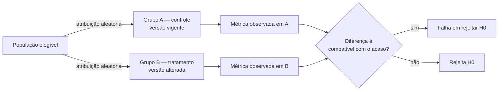

# Ciência de Dados — Aula 06: Teste A/B — O experimento controlado

## Introdução

A aula 05 apresentou o teste de hipótese como instrumento de decisão sobre uma amostra: dados os valores observados, decide-se entre a hipótese nula e a alternativa. A amostra era um dado do problema.

Esta aula inverte essa ordem. O teste A/B é um procedimento em que **a amostra é projetada antes de existir**, em função da decisão que se pretende tomar. O ferramental estatístico é o mesmo da aula anterior; o conteúdo novo está inteiramente no que antecede a coleta.

Esta primeira nota trata do que caracteriza um experimento e de como ele é especificado. O cálculo da amostra está na nota 02 e a análise do resultado na nota 03.

## Objetivos de aprendizagem

- Distinguir um experimento controlado de uma análise observacional, e justificar o que a aleatorização garante.
- Formular a hipótese de um teste A/B.
- Escolher a métrica principal, a métrica guarda-corpo e a unidade de aleatorização de um experimento.

## Desenvolvimento teórico

### Correlação e causalidade

Uma associação observada entre duas variáveis admite três explicações: a primeira causa a segunda, a segunda causa a primeira, ou ambas decorrem de uma terceira variável não observada, denominada **variável de confusão** (*confounder*).

Dados observacionais não permitem distinguir entre as três. O exemplo recorrente: usuários que utilizam determinado recurso de um produto apresentam retenção superior à média. A conclusão de que o recurso aumenta a retenção é injustificada, pois usuários mais engajados tendem tanto a usar mais recursos quanto a permanecer mais tempo. O engajamento prévio é a variável de confusão.

A aula 07 tratará de correlação e regressão, que medem e modelam associação. Nenhuma das duas técnicas, isoladamente, autoriza afirmação causal sobre dados observacionais.

### Experimento controlado

Define-se **experimento controlado** (*controlled experiment*) como aquele em que a atribuição do tratamento às unidades é determinada pelo experimentador, e não observada no mundo.

O **teste A/B** é o caso particular com duas condições:

- **grupo de controle** (A): recebe a versão vigente;
- **grupo de tratamento** (B): recebe a versão alterada.

A atribuição é **aleatória**. Essa é a propriedade que resolve o problema da seção anterior: sob aleatorização, os dois grupos têm distribuição esperada idêntica em **todas** as variáveis anteriores ao tratamento — inclusive naquelas que não foram medidas e nas que o experimentador desconhece. Qualquer diferença sistemática observada ao final é atribuível ao tratamento ou ao acaso, e é exatamente essa disjunção que o teste estatístico resolve.

A aleatorização não elimina o desequilíbrio entre grupos; ela o torna aleatório, e portanto quantificável. É por isso que o resultado vem acompanhado de uma probabilidade, e não de uma certeza.

### Hipótese

A hipótese de um teste A/B é uma afirmação sobre a métrica, e não sobre a mudança. A forma recomendada explicita a intervenção, a métrica e a direção esperada:

> Reduzir o formulário de cadastro de oito para quatro campos **aumenta** a taxa de conclusão do cadastro.

Formulada assim, ela se traduz diretamente nas hipóteses estatísticas da aula 05, com p_A e p_B denotando as taxas de conversão de cada grupo:

- H₀: p_A = p_B
- H₁: p_A ≠ p_B

A escolha entre formulação bilateral e unilateral é discutida na nota 03, e tem consequência sobre o teste aplicável.

### Métrica principal e métrica guarda-corpo

A **métrica principal** (*primary metric*) é aquela que decide o experimento. Deve ser única. Acompanhar várias métricas e declarar sucesso quando qualquer uma delas melhora caracteriza o problema de comparações múltiplas, tratado na nota 03.

A **métrica guarda-corpo** (*guardrail metric*) é aquela que não pode se degradar, ainda que a principal melhore. Ela protege contra o ganho local obtido às custas de um prejuízo maior: uma alteração que aumente o clique no botão e simultaneamente reduza a receita por usuário não é uma melhoria.

Critérios para a métrica principal:

- **sensível**: varia de forma detectável no horizonte do experimento;
- **atribuível**: sua variação decorre da mudança testada;
- **alinhada ao objetivo**: aproxima-se do resultado que se pretende obter, e não apenas de um indicador conveniente.

A tensão recorrente é entre métricas sensíveis e métricas alinhadas. Cliques respondem rápido e medem pouco; receita mede o que interessa e responde devagar. Métricas intermediárias, chamadas **métricas substitutas** (*surrogate metrics*), são um meio-termo cuja validade precisa ser justificada.

### Unidade de aleatorização

A **unidade de aleatorização** (*randomization unit*) é a entidade sorteada entre A e B: o usuário, a sessão ou a requisição individual.

A escolha não é arbitrária, e errá-la invalida o experimento por duas vias:

- **Consistência da experiência.** Aleatorizar por sessão faz o mesmo usuário ver versões diferentes em visitas distintas. Além de comprometer a experiência, isso contamina os grupos: o comportamento observado em uma sessão carrega efeito da versão vista na anterior.
- **Independência das observações.** O teste estatístico pressupõe observações independentes. Se a unidade de aleatorização é a sessão mas a métrica é contada por usuário, um mesmo usuário contribui com várias observações correlacionadas entre si. A variância real é subestimada, o p-valor sai menor do que deveria, e o falso positivo aumenta.

A regra prática: **a unidade de aleatorização deve coincidir com a unidade de análise da métrica**. Se a métrica é "taxa de usuários que converteram", a aleatorização é por usuário.

## Exemplos

### Exemplo 1 — Formulário de cadastro

| Elemento | Especificação |
|---|---|
| Hipótese | Reduzir o formulário de oito para quatro campos aumenta a taxa de conclusão do cadastro |
| Controle (A) | Formulário com oito campos obrigatórios |
| Tratamento (B) | Formulário com quatro campos obrigatórios; os demais dados são solicitados após o cadastro |
| Métrica principal | Taxa de conclusão do cadastro |
| Métrica guarda-corpo | Taxa de preenchimento dos dados complementares na semana seguinte |
| Unidade de aleatorização | Usuário |

A métrica guarda-corpo é o elemento que qualifica este experimento. É previsível que remover campos aumente a conclusão; a pergunta relevante é se os dados retirados do formulário chegam a ser coletados depois. Sem a guarda-corpo, o experimento mede um ganho e ignora o custo.

### Exemplo 2 — Página de checkout

Este é o caso que atravessa as três notas desta aula.

| Elemento | Especificação |
|---|---|
| Hipótese | Exibir o custo do frete antes da etapa de pagamento aumenta a taxa de conversão do checkout |
| Controle (A) | Frete exibido apenas na etapa final |
| Tratamento (B) | Frete exibido na primeira etapa |
| Métrica principal | Taxa de conversão do checkout, com conversão base de 5% |
| Métrica guarda-corpo | Receita média por pedido |
| Unidade de aleatorização | Usuário |

A guarda-corpo aqui protege contra um efeito plausível: antecipar o frete pode aumentar a conversão ao eliminar a surpresa no fim do fluxo, e simultaneamente deslocar a compra para carrinhos menores.

A nota 02 dimensiona este experimento; a nota 03 analisa seu resultado.

## Fontes e leituras

- KOHAVI, R.; TANG, D.; XU, Y. **Trustworthy Online Controlled Experiments: A Practical Guide to A/B Testing**. Cambridge: Cambridge University Press, 2020.
- MILLER, E. **How Not to Run an A/B Test**. 2010. Disponível em: https://www.evanmiller.org/how-not-to-run-an-ab-test.html. Acesso em: 19 set. 2026.
- SULLIVAN, G. M.; FEINN, R. Using Effect Size — or Why the P Value Is Not Enough. **Journal of Graduate Medical Education**, v. 4, n. 3, p. 279–282, 2012. Disponível em: https://pmc.ncbi.nlm.nih.gov/articles/PMC3444174/. Acesso em: 19 set. 2026.
