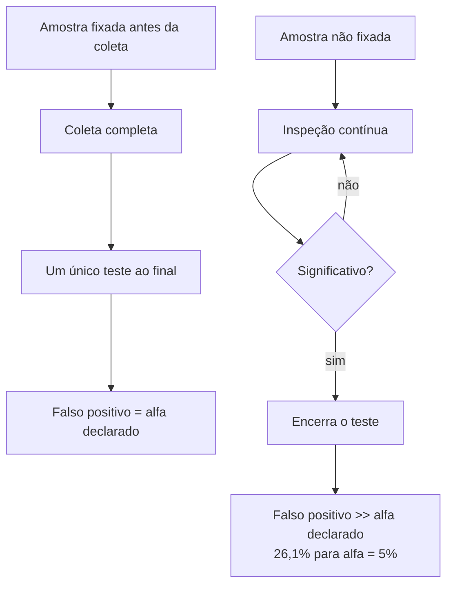

# Ciência de Dados — Aula 06: Teste A/B — Planejamento e tamanho de amostra

## Introdução

A nota 01 especificou o experimento: hipótese, métricas e unidade de aleatorização. Falta responder à pergunta que determina se ele é viável: **quantas observações são necessárias?**

A resposta não é uma questão de conveniência ou de orçamento. Ela decorre de três decisões tomadas antes da coleta, e a aritmética que as liga é o conteúdo central desta nota. Um experimento subdimensionado não produz resultado inconclusivo por azar: ele é incapaz, por construção, de detectar o efeito que se propôs a medir.

## Objetivos de aprendizagem

- Definir um efeito mínimo detectável e calcular o *h* de Cohen para duas proporções.
- Calcular o tamanho de amostra necessário a partir de α, poder e efeito mínimo detectável.
- Converter o tamanho de amostra em duração de teste.
- Explicar por que inspecionar o resultado antes do fim invalida o nível de significância declarado.

## Desenvolvimento teórico

### Efeito mínimo detectável

Define-se **efeito mínimo detectável** (*minimum detectable effect*, MDE) como a menor diferença entre os grupos que o experimento precisa ser capaz de detectar.

O MDE é uma decisão de negócio, não estatística. Ele deriva do menor ganho que justifica o custo de implementar a mudança. Um MDE definido como "qualquer diferença" é inexequível: detectar diferenças arbitrariamente pequenas exige amostra arbitrariamente grande.

Há duas formas de expressá-lo, e confundi-las altera o tamanho de amostra por ordem de grandeza:

- **absoluto**: de 5% para 6% é um MDE de 1 ponto percentual;
- **relativo**: de 5% para 6% é um MDE de 20%.

Ambas descrevem o mesmo experimento. A ambiguidade aparece quando o MDE é declarado apenas como "10%" — pode significar de 5% para 5,5% (relativo) ou de 5% para 15% (absoluto), que exigem amostras radicalmente diferentes.

**Significância estatística e significância prática são independentes.** Amostra suficientemente grande torna estatisticamente significativo qualquer efeito não nulo, inclusive os irrelevantes para a decisão. É por isso que o tamanho do efeito precisa ser reportado junto ao p-valor, e não em seu lugar (SULLIVAN; FEINN, 2012).

### O h de Cohen

Para comparar duas proporções, o tamanho de efeito padronizado é o **h de Cohen**:

$$h = 2\arcsin\left(\sqrt{p_1}\right) - 2\arcsin\left(\sqrt{p_0}\right)$$

A transformação arco-seno da raiz existe por uma razão específica: a variância de uma proporção depende da própria proporção, sendo máxima em 0,5 e mínima nos extremos. Uma diferença de 1 ponto percentual entre 5% e 6% não é estatisticamente equivalente à mesma diferença entre 50% e 51% — a primeira é mais fácil de detectar em termos relativos. A transformação estabiliza a variância, tornando *h* comparável em qualquer faixa de proporção.

Para o caso condutor, com p₀ = 0,05 e p₁ = 0,06:

$$h = 2\arcsin(\sqrt{0{,}06}) - 2\arcsin(\sqrt{0{,}05}) = 0{,}4949 - 0{,}4510 = 0{,}0439$$

### Os quatro parâmetros

O dimensionamento de um experimento envolve quatro grandezas que formam um sistema: **fixadas três, a quarta é determinada**.

| Parâmetro | Significado | Valor convencional |
|---|---|---|
| α | Probabilidade de erro tipo I: declarar diferença onde não há | 0,05 |
| poder (1−β) | Probabilidade de detectar o efeito, caso ele exista | 0,80 |
| MDE | Menor efeito que se deseja detectar | decisão de negócio |
| n | Observações por grupo | resultado do cálculo |

Para duas proporções independentes, alocação equilibrada e teste bilateral:

$$n = \frac{2\left(z_{1-\alpha/2} + z_{\text{poder}}\right)^2}{h^2}$$

O fator 2 tem origem na variância da estatística de teste. A variância de φ̂ = 2·arcsen(√p̂) é 1/n, e o teste compara **dois** grupos independentes, de modo que a diferença φ̂₁ − φ̂₂ tem variância 1/n₁ + 1/n₂ = 2/n na alocação equilibrada. Omitir esse fator reduz a amostra à metade e o poder efetivo a aproximadamente 0,51, em lugar de 0,80.

O resultado é o número de observações **por grupo**. O total do experimento é 2n. Confundir os dois é erro frequente e com consequência assimétrica: tratar o total como se fosse por grupo dobra o experimento sem necessidade; tratar o valor por grupo como se fosse o total reduz o experimento à metade e o poder a cerca de 0,51.

Aplicando ao caso condutor, com α = 0,05 e poder = 0,80:

$$n = \frac{2 \times (1{,}96 + 0{,}8416)^2}{0{,}0439^2} = \frac{2 \times 7{,}849}{0{,}001928} \approx 8.143 \text{ por grupo}$$

Adota-se **8.150 por grupo**, ou 16.300 no total.

O valor pode ser confirmado pela fórmula clássica de comparação de duas proporções, que não passa pela transformação arco-seno e devolve 8.158 por grupo — a diferença decorre da aproximação, e não da abordagem.

### Sensibilidade ao MDE

A relação entre n e MDE é a mais importante do planejamento, e a menos intuitiva. Como *h* entra ao quadrado no denominador, **reduzir o MDE pela metade multiplica a amostra por aproximadamente quatro**.

Com p₀ = 5%, α = 0,05 e poder = 0,80:

| MDE | Conversão alvo | n por grupo |
|---|---|---|
| +10% relativo | 5,5% | 31.217 |
| +20% relativo | 6,0% | 8.143 |
| +30% relativo | 6,5% | 3.765 |
| +40% relativo | 7,0% | 2.198 |

A consequência prática é direta: em produtos com conversão baixa, detectar melhorias pequenas exige volumes que muitas operações não possuem. Essa constatação é resultado legítimo do planejamento. A resposta correta, quando o tráfego disponível é insuficiente, é **rever o MDE ou não fazer o experimento** — nunca executá-lo subdimensionado e interpretar o resultado como se fosse conclusivo.

A sensibilidade a α e ao poder é menor, porém não desprezível:

| α | poder | n por grupo | total |
|---|---|---|---|
| 0,05 | 0,80 | 8.143 | 16.285 |
| 0,05 | 0,90 | 10.901 | 21.801 |
| 0,01 | 0,80 | 12.116 | 24.232 |
| 0,01 | 0,90 | 15.436 | 30.872 |

Exigir mais rigor custa amostra. A escolha de α = 0,01 e poder = 0,90 quase dobra o experimento em relação à convenção.

### Cálculo em código

A biblioteca `statsmodels` implementa o cálculo. A classe adequada para comparação de **duas proporções independentes** é `NormalIndPower`:

```python
from statsmodels.stats.power import NormalIndPower
from statsmodels.stats.proportion import proportion_effectsize

conversao_controle = 0.05
conversao_tratamento = 0.06      # MDE de +1 p.p., ou +20% relativo
alpha = 0.05
poder = 0.80

h = proportion_effectsize(conversao_tratamento, conversao_controle)
print(f"h de Cohen = {h:.4f}")

n_por_grupo = NormalIndPower().solve_power(
    effect_size=h,
    alpha=alpha,
    power=poder,
    ratio=1.0,                   # n_B / n_A
    alternative='two-sided',
)
print(f"{n_por_grupo:.0f} por grupo | {2 * n_por_grupo:.0f} no total")
```

Duas observações sobre a escolha da classe:

- `NormalIndPower` é o poder de um teste de **duas amostras independentes**. É o caso de um teste A/B.
- `GofChisquarePower` é o poder de um teste de **aderência** (*goodness of fit*), que compara **uma** amostra a uma distribuição conhecida de antemão. Não é o caso de um teste A/B, e o tamanho de efeito que ela espera é o *w* de Cohen, não o *h*.

A confusão entre as duas não é inofensiva. Para o caso condutor, `GofChisquarePower` com `n_bins=2` devolve 4.071, enquanto o valor correto é 8.143 **por grupo**, ou 16.300 no total. O número obtido pela classe errada é metade do necessário por grupo, e um quarto do total — um experimento dimensionado assim opera com poder próximo de 0,51.

### Alocação desbalanceada

A divisão não precisa ser 50/50. O parâmetro `ratio` expressa n_B/n_A:

```python
ratio = 3.0    # grupo B com o triplo do grupo A — divisão 25/75

n_a = NormalIndPower().solve_power(
    effect_size=h, alpha=alpha, power=poder,
    ratio=ratio, alternative='two-sided',
)
n_b = ratio * n_a
print(f"A = {n_a:.0f} | B = {n_b:.0f} | total = {n_a + n_b:.0f}")
```

A divisão 50/50 **minimiza o total** necessário para um dado poder. Qualquer desbalanceamento aumenta o número total de observações requeridas.

Ainda assim, desbalancear é comum, por razões externas à estatística: limitar a exposição a uma versão de risco (90/10), ou liberar um recurso gradualmente. O custo dessa decisão é exatamente o aumento do total, e o cálculo deve refleti-lo.

### Duração do teste

A duração decorre do total necessário e do tráfego elegível por dia:

$$\text{dias} = \left\lceil \frac{2n}{\text{tráfego diário elegível}} \right\rceil$$

Para o caso condutor, com 16.300 observações necessárias e 1.200 usuários elegíveis por dia: 13,6 dias, arredondados para **14 dias**.

Duas restrições se somam ao cálculo:

- **Ciclos completos.** O comportamento de usuários varia sistematicamente ao longo da semana. Um teste de três dias iniciado na terça mede terça, quarta e quinta, e extrapola para o fim de semana um comportamento que não observou. A duração deve cobrir ao menos uma semana completa, mesmo quando a amostra é atingida antes.
- **Encerramento em dia completo.** Interromper no meio do dia enviesa a amostra em favor do perfil de usuário daquele período.

No caso condutor, as duas restrições são compatíveis: 14 dias correspondem a duas semanas completas e satisfazem a amostra necessária.

### O custo de inspecionar cedo

O nível de significância α pressupõe **tamanho de amostra fixado antes da coleta**. Toda a construção da aula 05 depende disso.

A prática de acompanhar o resultado parcial e encerrar o teste assim que a diferença se torna significativa viola essa premissa. O procedimento é conhecido como **inspeção repetida** (*peeking*), e seu efeito é quantificável: sob inspeção contínua, um teste declarado a 5% de significância apresenta taxa real de falsos positivos de **26,1%** (MILLER, 2010).

A razão é a flutuação. Ao longo da coleta, a diferença entre os grupos oscila em torno do valor real. Mesmo quando não há efeito algum, essa oscilação cruza o limiar de significância em algum momento, com probabilidade que cresce a cada nova inspeção. Quem observa continuamente e para no primeiro cruzamento está selecionando o instante mais favorável de uma série aleatória.



Duas consequências operacionais:

- O resultado parcial não deve ser divulgado antes do fim do teste. Conhecê-lo cria pressão para interromper.
- Existem desenhos que **admitem** parada antecipada válida — testes sequenciais e abordagens bayesianas —, mas eles exigem correção do limiar de decisão e não são o teste da aula 05 aplicado antes da hora.

## Exemplos

### Planejamento completo do caso condutor

Retomando o experimento de checkout especificado na nota 01:

| Etapa | Decisão | Valor |
|---|---|---|
| Conversão base | Medida no histórico | 5,0% |
| MDE | Menor ganho que justifica a mudança | +1 p.p. (+20% relativo) |
| α | Convenção | 0,05 |
| Poder | Convenção | 0,80 |
| h de Cohen | Calculado | 0,0439 |
| n por grupo | Calculado | 8.150 |
| Total | 2n | 16.300 |
| Tráfego elegível | Medido | 1.200/dia |
| Duração | Calculada, ajustada ao ciclo semanal | 14 dias |

O experimento está especificado. Nenhum dado foi coletado ainda, e todas as decisões que afetam a validade do resultado já foram tomadas e registradas. É esse registro prévio que torna o teste final interpretável.

### Verificação por via independente

Recomenda-se conferir o resultado em uma calculadora de tamanho de amostra de acesso livre, como a disponível em `evanmiller.org`, informando os mesmos parâmetros. Divergências superiores a poucos por cento indicam, em geral, confusão entre MDE absoluto e relativo, ou entre n por grupo e n total.

## Fontes e leituras

- KOHAVI, R.; TANG, D.; XU, Y. **Trustworthy Online Controlled Experiments: A Practical Guide to A/B Testing**. Cambridge: Cambridge University Press, 2020.
- MILLER, E. **How Not to Run an A/B Test**. 2010. Disponível em: https://www.evanmiller.org/how-not-to-run-an-ab-test.html. Acesso em: 19 set. 2026.
- SULLIVAN, G. M.; FEINN, R. Using Effect Size — or Why the P Value Is Not Enough. **Journal of Graduate Medical Education**, v. 4, n. 3, p. 279–282, 2012. Disponível em: https://pmc.ncbi.nlm.nih.gov/articles/PMC3444174/. Acesso em: 19 set. 2026.
- STATSMODELS. **Power and Sample Size Calculations**. Documentação do módulo `statsmodels.stats.power`. Disponível em: https://www.statsmodels.org/stable/stats.html. Acesso em: 19 set. 2026.
